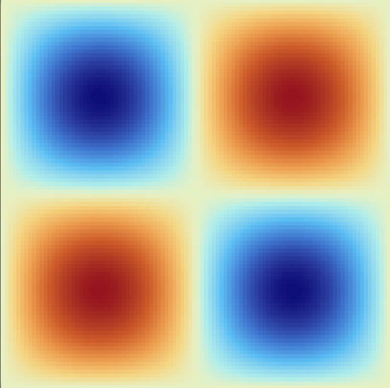
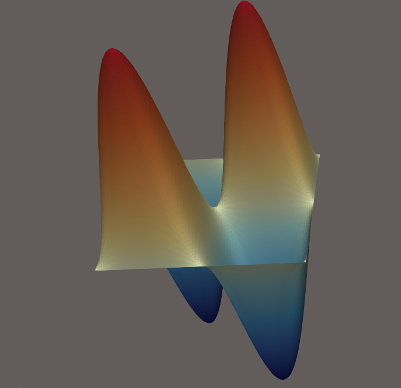

# challenge3

In this challenge we implemented a finite difference scheme to solve the laplace equation with Dirichlet boundary conditions, we used both MPI and openMP to parallelize the program.

## How the code is parallelized

For what concerns the MPI part, we split the computations among many processors, letting everyone write on its own copy of the solution vector u, summing them up at the end since (with MPI_Allreduce) we initialized the solution with 0, so it stays 0 in all the positions not handled by its processor.
The only delicate part is the communication between processor, since the boundary rows on every processor need a row that is computed by another processor, so everyone must comunicate its first and last row with its neighbours (of course first and last row only need to communicate one) usind MPI_Send and MPI_Rcv.
Each processor then computes its own local error, and once every error is smaller than a certain treshold (that can be modified in the data struct) we consider to have achieved convergence.
To do so on every iteration we use Allreduce to get the maximum error among all ranks and we check wether it is under the given treshold or not.
At the end, we compute the L2 error (using the exact solution) and we collect the solution, the mesh, the error, and all the information about convergence in a struct.
The number of MPI cores used has to be passed as an argument when running the program, while the number of threads in openMP is computed as the maximum number of processes that can be used at the same time on the computer divided by the number of mpi cores, so that we use all (and not more) the computational power avaialable. 

## .vtk file

In order to actually see the solution with our eyes on ParaView, we also wrote a function that creates a vtk file, ready to be analyzed and plotted.

## Difference with respect to sequential implementation

To see that there is an actual improvement with respect to the sequential case we measured the time taken by the problem, and introduced a parameter par, that is a boolean that deactivate all the parallelism in the code when it is false.
To see this we used the function run_parallel_vs_serial_tests() that compares serial and parallel on differenct grid dimension.
Here we see that if the grid is not big the parallel implementations is slower, since for small numbers the time spent dividing the computations among processes and communicating is more than the time saved with parallelism. However we can see that as the grid dimension gets bigger the speedup gets higher and higher.

## Scalability test

Inside the folder test we made a script that runs several times the program with different numbers of MPI cores (and thus different number of openMP threads since they are strictly correlated in our program). The resluts of this tests are stored in a file called results.txt, and there we can see which combination of MPI cores and openMP threads is the most efficient. We see that increasing the MPI cores reduces the time taken by the program to run, until a certain point where we reach a stall when we try to use more computational power than the one we have on our pc.
The test we did where on a mesh with 256 elements per side.
To run it it' enough to go on the folder challenge3-bogo-sort and type `bash test/scalability_test.sh`

These were Angelone's results:

MPI_PROCS    TIME(s)         ERROR           ITER        
1            23.6544         0.0461303       25671       
2            20.8746         0.0679198       24529       
4            8.91771         0.0982928       23401       
8            8.35291         0.109401        23069       
16           N/A             N/A             N/A    

In this case we see that the optimal number of processors is around 4, and the speed of the problem doesn't improve much after that.

These were Gnagnetti's results:

In the folder test one can see hardware information for both our computers.

